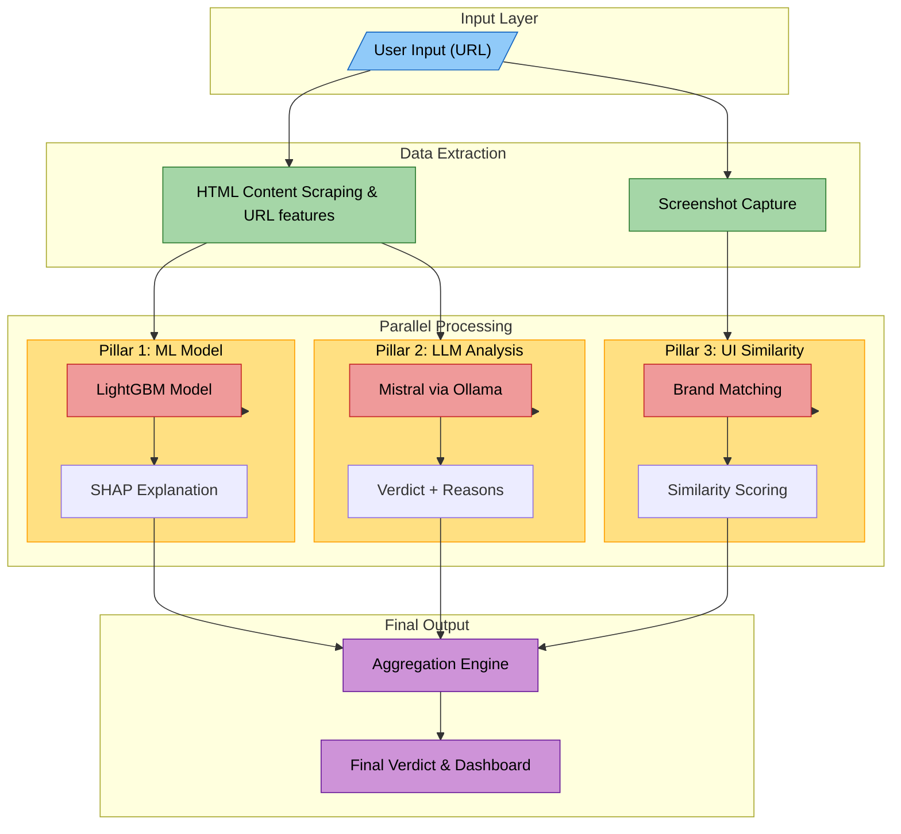
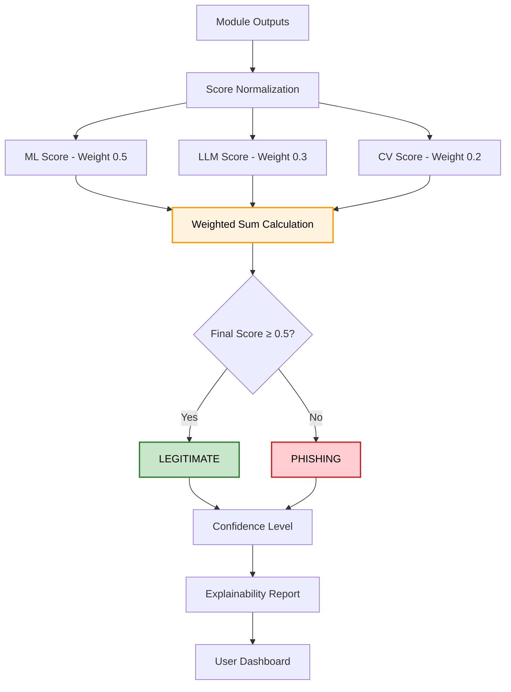

# 🌐 Spot the Fake: AI-Powered Fraud Detection System

[](https://python.org)
[](https://streamlit.io)
[](LICENSE)

## 🎯 Problem Statement

Digital fraud continues to evolve with phishing sites and brand impersonation. This repository provides a multi-modal detection system that combines machine learning, local LLM analysis, and visual similarity to provide fast, explainable verdicts.


## 💡 Our Solution

A **multi-modal AI system** that combines three powerful detection methods:

1. **🤖 ML-Based Phishing Detection** - feature engineering + LightGBM (phishing_lgbm.pkl).
2. **🧠 LLM Content Analysis** - local LLM via Ollama (Mistral) for contextual risk reasoning.
3. **👁️ Computer Vision Similarity** - screenshot capture (Selenium) + image hashing + OCR + fuzzy brand matching.

## 🏗️ System Architecture

```
Input (URL/Image) → Processing → [ML + LLM + CV] → Ensemble → Final Verdict
```

## 🔄 Processing Flow

Each analysis completes in under 30 seconds with parallel execution:

## System Architecture


<details>
<summary>View Mermaid Source</summary>


</details>
<hr style="border:1px solid #ccc; margin:30px 0;">



<hr style="border:1px solid #ccc; margin:30px 0;">


### Multi-Modal Analysis Pipeline:
- **Structural Analysis**: 30+ URL features, DNS patterns, domain characteristics
- **Content Analysis**: Web scraping + NLP via local LLM
- **Visual Analysis**: Screenshot comparison with brand references

## 🎬 Demo Video & Presentation Slides


<p align="center">
  <a href="https://youtu.be/cigAVGhOl-0?t=180">
    
  </a>
</p>


[View PDF Presentation](https://drive.google.com/file/d/1ud8WKoPKXwB3ZCWgTf8R2BDHT2CIhQzu/view?usp=sharing)

**Watch our complete system demonstration and technical walkthrough!**


## 🚀 Key Features

### ✨ Core Capabilities
- **Real-time Website Scanning** - Instant fraud detection
- **Brand Impersonation Detection** - Visual similarity analysis
- **Explainable AI** - SHAP plots + natural language reasoning
- **Multi-modal Fusion** - Weighted ensemble for robust decisions

### 🔧 Technical Highlights
- **Automated Screenshots** - Selenium-based capture with retry logic
- **Fuzzy Brand Matching** - RapidFuzz for domain-brand association
- **Advanced OCR** - Tesseract with preprocessing for text extraction
- **Robust Error Handling** - Graceful degradation when modules fail

---

## 📁 Project Structure

```
spot-the-fake--main/
├── `app1.py`                 # Visual similarity (website screenshot analysis)
├── `app2.py`                 # ML + LLM phishing classification utilities
├── `everything.py`          # Streamlit unified interface
├── `phishing_lgbm.pkl`      # Pre-trained LightGBM model
├── `dataset_phishing.csv`   # Training / reference data
├── `backend/`
│   ├── `app.py`             # Backend API entrypoint
│   ├── `models/loader.py`   # Model loader used by backend
│   └── `requirements.txt`
├── `frontend/`               # React frontend (optional)
│   ├── `package.json`
│   └── `src/`
├── `Brands/`                 # Reference brand screenshots
├── `User/`                   # Captured user screenshots
├── `modules/`                # Helper modules (e.g., `scam-detector.py`)
├── `requirements.txt`
└── `README.md`

```

## 🛠️ Installation & Setup

### Prerequisites

- Python 3.8+ on Windows
- Chrome browser (for Selenium)
- Tesseract OCR installed and on PATH
- Ollama installed and Mistral model pulled (for local LLM)

### Quick Start
```bash
# Clone repository
git clone https://github.com/yourusername/spot-the-fake.git
cd spot-the-fake

# Install dependencies
pip install -r requirements.txt
pip install -r backend/requirements.txt

# Install frontend dependencies:
cd frontend
npm install

# Install Ollama (for LLM analysis)
# Visit: https://ollama.ai/download
ollama pull mistral

# Install Tesseract OCR
# Windows: Download from GitHub releases
# macOS: brew install tesseract
# Linux: sudo apt install tesseract-ocr

# Run the application (backend)
python backend/app.py

# Run frontend (optional development):
cd frontend
npm run dev


```

### Dependencies
```txt

selenium
scikit-learn
lightgbm
shap
opencv-python
Pillow
imagehash
pytesseract
beautifulsoup4
rapidfuzz
requests
ollama
matplotlib
numpy
pandas
catboost
xgboost
Flask
flask-cors
```

## 🎮 Usage

### Web Interface
1. Launch the  app through react frontend: `cd frontend/ ; npm start`
2. Click Live Demo then Enter a suspicious URL in the input field
3. Get instant analysis with:
   - ML confidence scores
   - LLM contextual analysis
   - Visual similarity results
   - Combined final verdict

### Modules & Responsibilities

app2.py — Extracts URL features (length, special chars, TLD), runs LightGBM (phishing_lgbm.pkl), returns calibrated probabilities and SHAP explanations.

app1.py — Captures page screenshots (Selenium), computes pHash/dHash and color/text similarity, OCR with Tesseract, fuzzy brand matching using RapidFuzz.

everything.py — (optional) Streamlit front end that runs modules in parallel, normalizes scores, performs weighted ensemble, and displays SHAP/visual explainability for quick test checks.

frontend - Sleek Interactive React UI and Final Verdict Dashboard

backend/models/loader.py — Centralized model loading utilities used by the backend service.

modules/scam-detector.py — Utility functions used across modules (feature extraction, text cleaning, hashing helpers).


## 🔬 Technical Deep Dive

### Module 1: ML Phishing Detection (`app2.py`)
- **Features**: URL length, special characters, suspicious keywords, TLD patterns
- **Model**: LightGBM ensemble with probability calibration
- **Explainability**: SHAP TreeExplainer for feature importance
- **Performance**: Sub-second inference with detailed reasoning

### Module 2: Website Similarity Analysis (`app1.py`)
- **Image Hashing**: pHash + dHash for structural similarity
- **Color Analysis**: 3D histogram correlation
- **Text Extraction**: OCR with preprocessing + TF-IDF similarity
- **Fuzzy Matching**: RapidFuzz for brand name variations

### Module 3: Ensemble Integration (`everything.py`)
- **Weighted Fusion**: Configurable weights for each module
- **Adaptive Thresholding**: Context-aware decision boundaries
- **Real-time Interface**: Streamlit dashboard with visualizations

## 📊 Performance Metrics

### Detection Capabilities:
- **Phishing URLs**: High accuracy with SHAP explainability
- **Brand Impersonation**: Visual similarity detection
- **Content Analysis**: Natural language fraud indicators
- **Real-time Processing**: < 30 seconds total analysis time

### Ensemble & Scoring

Score normalization followed by weighted fusion:

- ML score weight: 0.5
- LLM score weight: 0.3
- CV score weight: 0.2
- Adaptive thresholding with final verdict: final_score >= 0.5 → LEGITIMATE, else PHISHING

Explainability outputs:

- SHAP feature importances (ML)
- LLM natural language reasoning + evidence
- Visual similarity breakdown (hash, color, OCR overlap)

## 🎨 User Experience

### Dashboard Features:
- **Input Validation**: Real-time URL checking
- **Progress Indicators**: Visual feedback during analysis
- **Detailed Results**: Component-wise breakdowns
- **Explainable AI**: Why decisions were made

### Visualization Components:
- SHAP feature importance plots
- Similarity score breakdowns
- Contribution weight charts
- Risk level indicators

## 🌟 Innovation Highlights

### Novel Contributions:
1. **First Multi-Modal Fusion** for fraud detection
2. **Brand Impersonation Detection** via computer vision
3. **Local LLM Integration** for privacy-preserving analysis
4. **Explainable Ensemble** with transparent decision making

### Technical Achievements:
- Automated brand-domain fuzzy matching
- Multi-hash image similarity algorithm
- Robust web automation with error recovery
- Real-time analysis pipeline

## 🚀 Future Roadmap

### Immediate (Post-Hackathon):
- [ ] Browser extension development
- [ ] Mobile app for iOS/Android
- [ ] REST API for third-party integration
- [ ] Expanded brand reference database

### Long-term Vision:
- [ ] Real-time threat intelligence feeds
- [ ] Deep learning models for advanced evasion
- [ ] Multi-language content analysis
- [ ] Blockchain-based reputation scoring

## 🏆 Hackathon Impact

### Problem Solved:
✅ **Proactive Detection** - No more waiting for user reports  
✅ **Multi-Modal Analysis** - Comprehensive fraud assessment  
✅ **Explainable Results** - Transparent AI decisions  

### Business Applications:
- **Financial Institutions**: Customer protection
- **E-commerce Platforms**: Seller verification
- **Corporate Security**: Employee phishing prevention
- **Browser Vendors**: Built-in fraud protection

## 👥 Team

- *Harsh Jain*
- *Rishiraj Gupta*
- *Nikhil Singh*
- *Sumit Kothari*

## 📝 License

This project is licensed under the MIT License - see the [LICENSE](LICENSE) file for details.

## 🙏 Acknowledgments

- Hackathon organizers for the inspiring challenge
- Open-source community for the amazing tools
- Security researchers for fraud pattern insights
